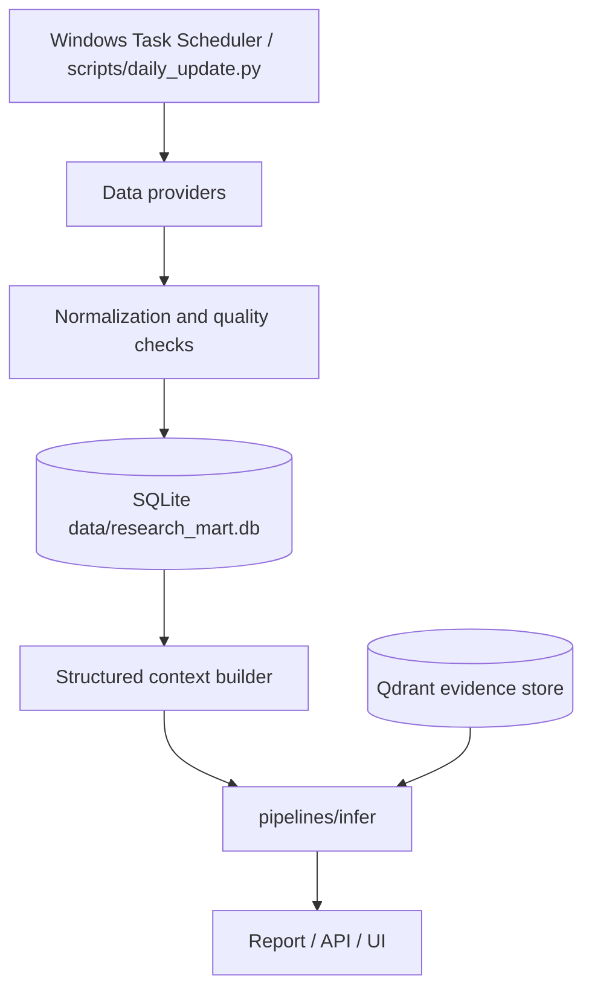

# Architecture

## End-to-End Flow

The Research Assistant follows a sequential architectural flow modeled globally inside `pipelines/orchestration/research_pipeline.py`:

```mermaid
graph TD
    A[CLI Request] --> B[AnalysisRequest]
    B --> C[pipelines/collect]
    C --> D[Yahoo / FRED / SEC / Google RSS / optional Alpha-OpenBB-FMP]
    D --> E[Raw Documents]
    E --> F[pipelines/ingest]
    F --> G[(Qdrant Vector DB)]
    G --> H[pipelines/retrieve]
    H --> I[pipelines/infer]
    I --> J[Ollama / qwen2.5:7b primary]
    J --> K[Raw Output Dict]
    K --> L[pipelines/analyze]
    L --> M[AnalysisResponse]
    M --> N[Report Generator]
    N --> O[Outputs (JSON/Markdown/HTML)]
```

The scheduled data path is additive to the request-time RAG path:



Qdrant remains a document evidence store. Structured market data belongs in the data mart:

- `data/research_mart.db`: assets, daily OHLCV, macro series/observations, article metadata, filings, update runs, provider status, quality checks.
- `data/runs.db`: research execution history and output lookup only.
- Qdrant: news, filings, transcripts, report chunks, and current-run evidence retrieval.

## Data Movement
1. AnalysisRequest initializes the process.
2. `collect` fetches bounded source-specific records, records per-source status, and saves a snapshot into `data/raw`.
3. `ingest` processes, normalizes, chunks, and creates vectors inside Qdrant.
4. `retrieve` translates the query and isolates exactly `top_k` documents to fit context windows.
5. The structured context builder loads authoritative numeric price/macro/freshness data from `data/research_mart.db` when available.
6. The model adapter accepts the `documents` array, structured context, and the string query, then outputs JSON.
7. The analyze layer builds summaries.
8. Save routines dump it to `data/outputs`.

## Structured Data Mart Boundary

`pipelines/data_mart` owns structured storage and scheduled updates:

- `storage/schema.py`: idempotent SQLite DDL and schema version.
- `storage/db.py`: SQLite connection setup, WAL mode, migration table, `init_db()`.
- `storage/repository.py`: upsert/query APIs for prices, macro observations, news metadata, SEC filing metadata, run logs, provider status, and quality checks.
- `providers/*`: external provider adapters such as yfinance and FRED.
- `jobs/*`: daily update orchestration for prices, macro, news, SEC filings, and data quality checks.
- `context/structured_context.py`: converts stored data into LLM-safe numeric context with source, `as_of`, and freshness metadata.

LLM numeric policy:

- Structured context is authoritative for numeric values.
- RAG documents are qualitative/citation evidence.
- If a required structured value is missing or stale, the report must surface partial/unknown state instead of inventing a metric.

## Quant Analytics Boundary

The deterministic quant layer is split by responsibility:

- `pipelines/factors`: returns, momentum, volatility, drawdown, correlation, rate sensitivity.
- `pipelines/backtest`: strategy execution, cost/slippage assumptions, no-lookahead signal application, metrics.
- `pipelines/portfolio`: equal weight, inverse volatility, risk parity-style inverse-vol baseline, and max-Sharpe baseline optimizer.
- `pipelines/analyze/portfolio_quant.py`: existing deterministic API baseline retained for `/api/v1/research/portfolio/risk`.

## Provider Boundary

- The default data path is key-light: Yahoo/yfinance for market/news, FRED for macro when configured, SEC EDGAR for official filings, and Google News RSS for keyless article coverage.
- Alpha Vantage news is a key-backed fallback that runs before OpenBB/FMP when `ALPHA_VANTAGE_ENABLED=true`.
- OpenBB is installed and checked by `scripts/check_openbb_compat.py`, but OpenBB news is opt-in (`OPENBB_NEWS_ENABLED=true`) because provider package combinations can fail at runtime even when dependency metadata is valid.
- FMP is auxiliary only. FMP stock news and transcripts are called only when `FMP_ENABLED=true` and the relevant credentials are present.
- The validation gate includes provider compatibility separately from runtime preflight so package breakage, provider entitlement, and network reachability are not conflated.

## Output Traceability Contract

- Every numeric or value-bearing item surfaced through `key_metrics` must carry `as_of`.
- Preferred `as_of` source is the supporting evidence block date (`RetrievalItem.date`) matched by `evidence_doc_ids`.
- If the model omits `as_of`, orchestration backfills it from the cited document date before building `AnalysisResponse` or `TopicResponse`.
- If no date can be resolved, the field is set to `unknown` and reports/UI render that as an explicit unknown 기준일 instead of silently omitting freshness.
- Reports and the UI must display this basis date next to the metric value so users can distinguish current values from stale evidence.
- Claim-level evidence is also audited: bull/bear points and topic drivers, risks, scenarios, and execution strategies carry `evidence_doc_ids`; report/UI rendering resolves those ids back to document dates and sources.

## Topic Quant Snapshot

- Topic mode adds a deterministic quant layer before LLM inference in `pipelines/analyze/topic_quant.py`.
- For `rates_bonds` and `TLT`, the layer derives Treasury yield levels, 10Y-2Y curve, real-yield proxy, TLT price trend when available, duration proxy, and rate-shock sensitivity.
- The same canonical layer now emits proxy quant snapshots for credit, FX, commodity, crypto, and sector/theme questions. Each metric carries value, unit, `as_of`, source, evidence ids, and freshness status.
- The snapshot is injected into the topic prompt as authoritative evidence, merged into `key_metrics`, and stored at `execution_meta.extras.quant_snapshot`.
- Quant-backed buckets can substitute for missing market-structure evidence. For TLT, missing latest catalyst/news is warning-only when macro plus market-structure or quant substitute exists.
- Quality gates record `metric_as_of_coverage`, `claim_evidence_date_coverage`, bucket coverage, substituted buckets, and actionable partial reasons.

## Model Capability Boundary

- `core/utils/model_capabilities.py` is the registry for local model routing assumptions.
- Production final reports use `qwen2.5:7b` through the Ollama structured-output path. Legacy aliases (`mistral`, `primary`, `ollama`, `llama-2`) resolve to the same primary model for runtime compatibility.
- `fingpt` is classified as auxiliary-only for now: useful for future event extraction, sentiment/risk tagging, and financial tone classification, but restricted from final JSON/report generation unless its `json_reliability`, Korean dominance, and structured-output support are proven.
- Every run records the active profile in `execution_meta.extras.model_capabilities` so reports and diagnostics can audit why a model was or was not used.

## Error Taxonomy

Pipeline failures and partials are normalized into additive `execution_meta.extras.error_type` values:
`validation_error`, `data_unavailable`, `evidence_sparse`, `model_json_error`, `model_language_error`, `provider_entitlement`, `infrastructure_error`, and `unknown_error`.
The UI renders these as Korean action messages instead of exposing raw parser exceptions.

## Engineering Constraints

> [!CAUTION] 
> **Implicit Blocking Rule for Async Layers**
> Any concrete async component that performs blocking local work (such as heavy ML inference, large database I/O, or web requests) MUST internally offload that work with `asyncio.to_thread` or an equivalent non-blocking mechanism. 
> 
> No concrete implementation is ever allowed to block the FastAPI event loop directly. This rule applies intensely to future Risk Engines, Model Adapters, and Retrieval backends that are invoked asynchronously from the main pipeline. 
