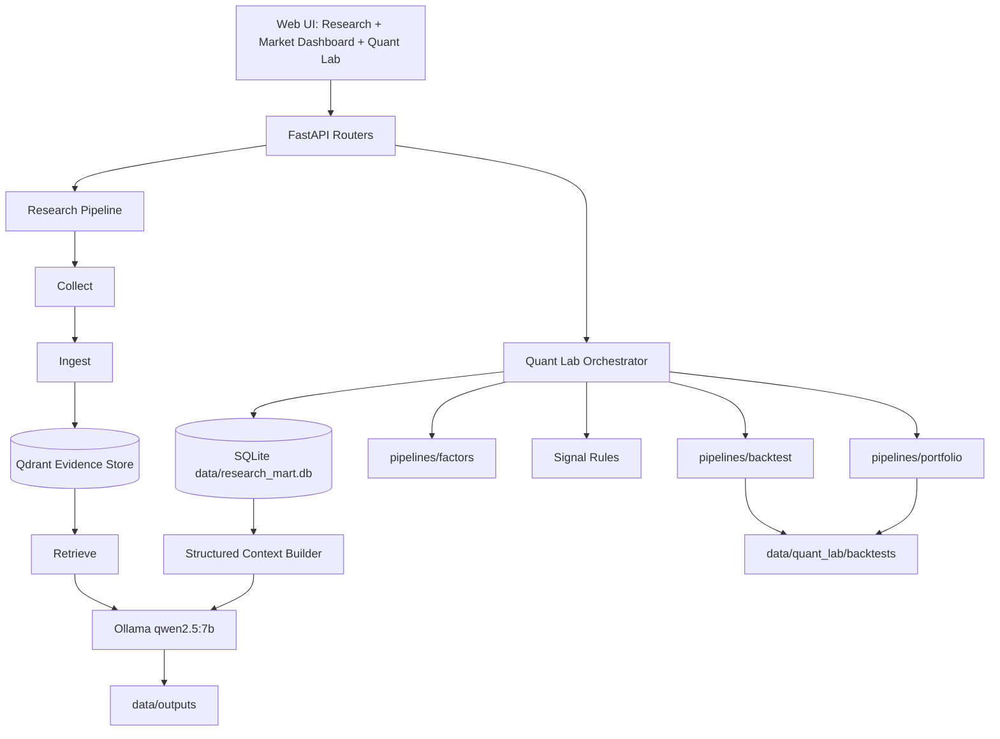

# Fincept-Compatible Quant Lab Design

> Status: completed and re-verified 2026-05-05 12:11 KST; product-depth extensions are tracked separately.
> Date: 2026-05-04
> Target repo: `F:\LLM\FinGPT`

## Goal

Extend the existing FinGPT local research assistant into a robust Quant Lab while preserving the current Research, RAG, data mart, API, and UI contracts.

The target is not to copy FinceptTerminal. The target is to benchmark its Quant Lab information architecture and adapt the useful ideas into this repository's existing FastAPI + SQLite data mart + deterministic quant engine + local LLM research architecture.

## Non-Negotiable Constraints

1. Do not copy FinceptTerminal source code, visual identity, assets, protected layout, naming, or trade dress.
2. Do not create a parallel `pipelines/quant` subsystem that duplicates existing `data_mart`, `factors`, `backtest`, and `portfolio` modules.
3. Do not break existing endpoints:
   - `POST /api/v1/research`
   - `POST /api/v1/research/analyze`
   - `POST /api/v1/research/universal`
   - `POST /api/v1/research/compare`
   - `POST /api/v1/research/stream`
   - `POST /api/v1/research/universal/stream`
   - `POST /api/v1/research/portfolio/risk`
   - `GET /api/v1/data/health`
   - `GET /api/v1/data/prices/{ticker}`
   - `POST /api/v1/backtest/run`
   - `POST /api/v1/portfolio/optimize`
4. Keep Qdrant as document evidence storage only.
5. Keep `data/research_mart.db` as the canonical structured data source.
6. Keep `data/runs.db` as research run history only.
7. LLMs may interpret evidence and produce qualitative research scores, but must not calculate backtest metrics, portfolio weights, returns, Sharpe, drawdown, or trade execution.
8. Signals generated from close prices must execute at the next bar or later.
9. Every numeric output used for decisions must carry `as_of`, `source`, and freshness/diagnostic context where feasible.
10. Stale, partial, empty, failed, and credentials-missing states must be visible in the UI and API diagnostics.

## Source Review

### FinceptTerminal Observations

Reviewed external source:

- Repository: `https://github.com/Fincept-Corporation/FinceptTerminal`
- AI Quant Lab folder: `fincept-qt/scripts/ai_quant_lab`
- Backtesting provider process: `fincept-qt/docs/backtesting-provider-process.md`
- License: repository `LICENSE`

FinceptTerminal is a C++20/Qt6 native terminal with embedded Python analytics. Its AI Quant Lab is Qlib-heavy and includes modules for data processing, feature engineering, strategy, backtesting, portfolio optimization, reporting, reinforcement learning, online learning, high-frequency trading, meta learning, and rolling retraining.

Relevant concepts worth adapting:

- Python analytics as source of truth for strategy/provider metadata.
- Dynamic strategy and indicator catalogs instead of hardcoded UI-only lists.
- Explicit provider registration and verification.
- Feature engineering catalog.
- Strategy/backtest/portfolio/reporting workflow.
- Strict cross-checking between UI-visible options and backend-supported command IDs.
- End-to-end backtest verification before considering a provider ready.

Concepts that should not be copied into this repo directly:

- Qlib service implementation.
- RDAgent implementation.
- Qt/C++ screen architecture.
- Fincept-specific UI layouts, color identity, function-code vocabulary, or protected trade dress.
- Fincept source code or assets.
- Immediate use of its model zoo, HFT, RL, online learning, or advanced order-book simulator.

### License And Trade Dress Risk

FinceptTerminal's license page identifies AGPL-3.0 plus a commercial licensing notice and additional trademark/trade dress restrictions. Therefore this repo must treat Fincept as a reference only:

- Acceptable: learn from broad product concepts and workflow patterns.
- Not acceptable: copy source files, UI layouts, names, screens, assets, screenshots, icons, color palette, protected command vocabulary, or distinctive trade dress.
- Required design policy: implement a FinGPT-native Quant Lab with its own layout, labels, flow, and code.

## Current FinGPT Architecture Inventory

### Existing Research Path

Current documented flow:

```text
Collect -> Ingest -> Retrieve -> Infer -> Analyze -> Report
```

Core modules:

- `pipelines/collect`: source collection.
- `pipelines/ingest`: document normalization and Qdrant ingestion.
- `pipelines/retrieve`: current-run evidence retrieval.
- `pipelines/infer`: Ollama/local model inference.
- `pipelines/analyze`: deterministic analysis helpers and report building.
- `pipelines/orchestration`: research/topic pipeline wiring.

### Existing Structured Data Mart

Current canonical structured store:

- `data/research_mart.db`

Existing modules:

- `pipelines/data_mart/storage/schema.py`
  - `assets`
  - `prices_daily`
  - `macro_series`
  - `macro_observations`
  - `news_articles`
  - `filings`
  - `data_update_runs`
  - `provider_status`
  - `data_quality_checks`
- `pipelines/data_mart/storage/db.py`
- `pipelines/data_mart/storage/repository.py`
- `pipelines/data_mart/providers/yfinance_provider.py`
- `pipelines/data_mart/providers/fred_provider.py`
- `pipelines/data_mart/jobs/update_prices_daily.py`
- `pipelines/data_mart/jobs/update_macro_daily.py`
- `pipelines/data_mart/jobs/update_news_daily.py`
- `pipelines/data_mart/jobs/update_filings_daily.py`
- `pipelines/data_mart/jobs/quality_checks.py`
- `pipelines/data_mart/context/structured_context.py`

Design implication:

The Quant Lab must read market data from this mart first. Parquet can be added later as an analytics cache/export layer, but not as the primary source of truth in the first implementation phase.

### Existing Quant Layer

Existing deterministic modules:

- `pipelines/factors/core.py`
  - `simple_returns`
  - `momentum_return`
  - `realized_volatility`
  - `drawdown_series`
  - `correlation_matrix`
  - `rate_sensitivity`
- `pipelines/backtest/engine.py`
  - `BacktestConfig`
  - `run_backtest`
  - `run_momentum_ranking_backtest`
  - `run_multi_asset_backtest`
- `pipelines/backtest/metrics.py`
  - `performance_metrics`
- `pipelines/portfolio/optimizer.py`
  - `optimize_portfolio`
  - equal weight
  - inverse volatility
  - risk parity
  - minimum volatility
  - max Sharpe
  - momentum tilt
- `pipelines/analyze/portfolio_quant.py`
  - existing deterministic portfolio risk baseline for `/api/v1/research/portfolio/risk`

Design implication:

The next Quant Lab work should extend these modules. Creating duplicate versions under a new `pipelines/quant` namespace would increase drift and break auditability.

### Existing API Surface

Existing quant/data endpoints in `app/api/server.py`:

- `GET /api/v1/data/health`
- `GET /api/v1/data/prices/{ticker}`
- `POST /api/v1/backtest/run`
- `POST /api/v1/portfolio/optimize`
- `GET /api/v1/dashboard/equity-heatmap`
- `GET /api/v1/dashboard/market`
- `GET /api/v1/dashboard/news`

Current request models inside `app/api/server.py`:

- `BacktestRunRequest`
- `PortfolioOptimizeRequest`

Design implication:

Before adding a richer Quant Lab API, split the server into routers without behavior changes. The first API work should be a refactor with tests, not a feature rewrite.

### Existing Web UI Surface

Existing UI files:

- `app/web/index.html`
- `app/web/app.js`
- `app/web/styles.css`

Existing UI surfaces include:

- Market dashboard tab.
- Quant Lab tab.
- TradingView chart card.
- Finviz-style equity heatmap.
- Market snapshot.
- Data health card.
- Asset detail card.
- Backtest card.
- Portfolio optimizer card.
- News card.
- Research result tabs including Quant, Risk, Scenarios, Evidence, Diagnostics, Report, Raw JSON.

Design implication:

The UI should be evolved in place. A later split into `quant_lab.js` is reasonable only after API contracts are stable and `scripts/check_ui_contract.py` covers the new DOM/API assumptions.

## ChatGPT Plan Evaluation

### Directionally Correct

The pasted plan is correct on these principles:

- Keep Research Engine and Quant Lab separate.
- Let LLM interpret but not compute.
- Add strategy builder, factor preview, signal generation, backtest, portfolio, data health, run history, and diagnostics.
- Require no-lookahead validation.
- Require stale/missing data visibility.
- Use deterministic backtest/portfolio engines.
- Add tests for lookahead, metrics, data alignment, and signal generation.

### Required Corrections

The plan should be corrected before implementation:

1. Do not create a new full `pipelines/quant` tree that duplicates existing modules.
2. Do not make Parquet the primary data cache before data mart contracts are mature.
3. Do not add Qlib/RDAgent as a first-phase dependency.
4. Do not copy Fincept code, UI, or terminology.
5. Do not overbuild RL/HFT/meta-learning/order-book simulation before the daily vectorized engine is audited.
6. Do not split `app/web/app.js` first. First lock API response shapes and UI contract tests.
7. Do not add Black-Litterman/HRP as default first-phase features. Keep them later/optional.
8. Do not allow provider fallback to hide stale data; status must remain explicit.

## Target Architecture



### Boundary Rules

#### Research Layer

Owns:

- Current-run document evidence.
- Source citations.
- Qualitative thesis, catalysts, risks, scenarios.
- LLM-generated interpretation.

Does not own:

- Returns calculation.
- Portfolio weights.
- Backtest metrics.
- Trade execution assumptions.

#### Data Mart Layer

Owns:

- Daily prices.
- Macro observations.
- News metadata.
- Filings metadata.
- Provider status.
- Quality checks.
- Update run history.

Does not own:

- Qdrant chunks.
- Research report JSON/Markdown/HTML.
- LLM prompts.

#### Quant Engine Layer

Owns:

- Factor calculations.
- Signal generation.
- No-lookahead enforcement.
- Backtest execution.
- Metrics.
- Portfolio optimization.
- Risk diagnostics.

Does not own:

- Raw provider API calls outside defined provider adapters.
- LLM interpretation.
- UI state.

#### UI Layer

Owns:

- Workflow layout.
- Loading, empty, stale, partial, failed, success states.
- User inputs.
- Rendering API diagnostics without hiding uncertainty.

Does not own:

- Backtest calculation.
- Feature calculation.
- Portfolio optimization.
- Data freshness decisions.

## Proposed Module Design

### API Routers

Add routers only after preserving behavior with tests.

Create:

- `app/api/routers/research.py`
- `app/api/routers/data.py`
- `app/api/routers/dashboard.py`
- `app/api/routers/quant_lab.py`
- `app/api/routers/portfolio.py`
- `app/api/routers/watchlist.py`
- `app/api/routers/system.py`

Keep compatibility:

- Existing endpoint paths must remain unchanged.
- `app/api/server.py` should become application setup, middleware, lifecycle, and router registration.
- Move request models out of `server.py` only after tests prove no OpenAPI/validation regressions.

### Schemas

Extend existing schemas instead of replacing them.

Existing:

- `core/schemas/quant.py`
- `core/schemas/portfolio.py`

Add:

- `QuantFeaturePreviewRequest`
- `QuantFeaturePreviewResponse`
- `QuantSignalGenerateRequest`
- `QuantSignalGenerateResponse`
- `QuantBacktestRequest`
- `QuantBacktestResponse`
- `QuantRunDiagnostics`
- `QuantArtifactManifest`
- `StrategyDefinition`
- `StrategyRegistryItem`
- `PortfolioOptimizeV2Request`
- `PortfolioOptimizeV2Response`

All response schemas should include:

- `status`: `success | partial | failed | empty`
- `as_of`
- `data_status`
- `diagnostics`
- `warnings`
- `artifacts`

### Quant Lab Orchestrator

Create:

- `pipelines/orchestration/quant_lab_pipeline.py`

Responsibilities:

- Validate requested universe.
- Load canonical prices from data mart.
- Run data quality checks.
- Build feature matrix from `pipelines/factors`.
- Build deterministic signals.
- Run backtest via `pipelines/backtest`.
- Optionally attach latest research score as an input feature when available and fresh.
- Save artifacts under `data/quant_lab/backtests/{run_id}`.
- Return response DTO suitable for UI charts and diagnostics.

This file should not implement indicator math directly.

### Factor Catalog

Extend:

- `pipelines/factors/core.py`

Add only deterministic, testable daily factors first:

- moving average
- moving average ratio
- RSI
- MACD histogram
- Bollinger z-score
- ATR-like range volatility if high/low exists
- relative strength versus benchmark
- rolling beta
- rolling correlation
- rolling drawdown

Add:

- `pipelines/factors/catalog.py`

Responsibilities:

- Expose supported factor IDs.
- Define parameter schemas.
- Provide UI-safe labels and descriptions.
- Map IDs to pure calculation functions.

Example factor IDs:

```text
return_1d
return_5d
momentum_21d
momentum_63d
momentum_126d
realized_vol_21d
drawdown_current
ma_ratio_20_50
ma_ratio_50_200
rsi_14
relative_strength_spy_63d
beta_spy_126d
rate_sensitivity_dgs10_126d
```

### Signal Engine

Create:

- `pipelines/signals/base.py`
- `pipelines/signals/rule_based.py`
- `pipelines/signals/research_score.py`

Responsibilities:

- Convert factors into deterministic signal rows.
- Keep research score optional.
- Mark research score unavailable when no fresh research output exists.
- Never let LLM output directly become a trade.

Initial signal templates:

1. `buy_and_hold`
2. `moving_average_trend`
3. `volatility_targeting`
4. `momentum_ranking`
5. `research_confirmed_momentum`
6. `macro_tlt_trend`
7. `multi_asset_risk_regime`

Signal row contract:

```json
{
  "date": "2026-05-04",
  "ticker": "SPY",
  "factor_values": {
    "momentum_63d": 0.042,
    "realized_vol_21d": 0.168
  },
  "research_score": null,
  "final_score": 0.71,
  "signal": 1.0,
  "execution_date": "2026-05-05",
  "lookahead_policy": "close_signal_next_bar_execution",
  "diagnostics": []
}
```

### Backtest Engine

Extend:

- `pipelines/backtest/engine.py`
- `pipelines/backtest/metrics.py`

Add:

- `pipelines/backtest/validation.py`
- `pipelines/backtest/artifacts.py`

Required behavior:

- Use adjusted close by default.
- Reject or mark partial when price history is insufficient.
- Align multi-asset calendars explicitly.
- Apply signals one bar after generation.
- Apply transaction cost and slippage.
- Return a single portfolio equity curve for multi-asset backtests.
- Report missing assets, excluded assets, and insufficient common history.
- Save artifacts with config hash.

Metrics to add or standardize:

- total return
- CAGR
- annualized volatility
- Sharpe
- Sortino
- max drawdown
- Calmar
- win rate
- profit factor when trade PnL is available
- turnover
- exposure
- beta to benchmark
- benchmark excess return
- best month
- worst month
- longest drawdown duration

Validation output:

```json
{
  "lookahead_safe": true,
  "signal_shift_bars": 1,
  "execution_assumption": "next_bar_close",
  "adjusted_price_used": true,
  "missing_price_rows": 0,
  "stale_data": false,
  "cost_model": {
    "transaction_cost_bps": 5.0,
    "slippage_bps": 2.0
  }
}
```

### Portfolio Engine

Extend:

- `pipelines/portfolio/optimizer.py`

Add:

- `pipelines/portfolio/constraints.py`
- `pipelines/portfolio/diagnostics.py`

Keep initial methods:

- equal weight
- inverse volatility
- risk parity
- minimum volatility
- max Sharpe
- momentum tilt

Add later as optional:

- hierarchical risk parity
- Black-Litterman
- robust covariance shrinkage

Portfolio response must expose:

- weights
- sum of weights
- missing assets
- capped assets
- risk contributions
- expected annual return
- annualized volatility
- Sharpe
- correlation matrix
- data range
- return counts
- diagnostics

### Strategy Registry

Create:

- `pipelines/strategies/registry.py`
- `pipelines/strategies/storage.py`
- `config/quant_strategies/defaults.yaml`

Do not store strategy definitions only in UI state.

Strategy definition contract:

```yaml
strategy_id: research_confirmed_momentum_v1
name: Research Confirmed Momentum
universe:
  - SPY
  - QQQ
  - TLT
benchmark: SPY
frequency: daily
features:
  momentum_63d:
    id: momentum_63d
    lookback: 63
  realized_vol_21d:
    id: realized_vol_21d
    lookback: 21
  research_score:
    id: research_score
    max_age_days: 7
signal:
  type: score_threshold
  formula:
    momentum_63d: 0.55
    realized_vol_21d_inverse: 0.20
    research_score: 0.25
  long_threshold: 0.60
  exit_threshold: 0.30
portfolio:
  method: equal_weight
  max_weight: 0.35
execution:
  trade_at: next_bar_close
  transaction_cost_bps: 5
  slippage_bps: 2
diagnostics:
  require_fresh_prices: true
  require_no_lookahead: true
```

### Artifact Storage

Create under:

- `data/quant_lab/backtests/{run_id}/`

Each run should write:

- `config.json`
- `metrics.json`
- `diagnostics.json`
- `equity_curve.json`
- `drawdown_curve.json`
- `trades.json`
- `signals.json`
- `weights.json`
- `manifest.json`

Optional future export:

- Parquet equivalents for large runs. Implemented later as an optional dependency-detected artifact export in the 2026-05-05 06:08 KST run.

Run ID format:

```text
qlab_{utc_timestamp}_{strategy_or_template}_{config_hash}
```

Example:

```text
qlab_20260504T110312Z_momentum_ranking_8f4c2a9b
```

## Proposed API Design

### Compatibility Layer

Retain current routes:

- `POST /api/v1/backtest/run`
- `POST /api/v1/portfolio/optimize`

These can call the new orchestration layer internally after compatibility tests are updated.

### New Quant Lab Routes

Add:

- `GET /api/v1/quant/config`
- `POST /api/v1/quant/features/preview`
- `POST /api/v1/quant/signals/generate`
- `POST /api/v1/quant/backtest`
- `GET /api/v1/quant/backtest/{run_id}`
- `GET /api/v1/quant/backtest/{run_id}/metrics`
- `GET /api/v1/quant/backtest/{run_id}/trades`
- `GET /api/v1/quant/backtest/{run_id}/signals`
- `POST /api/v1/quant/strategy/save`
- `GET /api/v1/quant/strategy/list`
- `GET /api/v1/quant/strategy/{strategy_id}`
- `DELETE /api/v1/quant/strategy/{strategy_id}`

Do not add streaming until the synchronous JSON route is stable and tested.

### Feature Preview Request

```json
{
  "tickers": ["SPY", "QQQ", "TLT"],
  "benchmark": "SPY",
  "start_date": "2024-01-01",
  "end_date": "2026-05-04",
  "features": [
    {"id": "momentum_63d", "lookback": 63},
    {"id": "realized_vol_21d", "lookback": 21},
    {"id": "drawdown_current"},
    {"id": "relative_strength_spy_63d"}
  ]
}
```

### Feature Preview Response

```json
{
  "status": "success",
  "as_of": "2026-05-04",
  "rows": [
    {
      "ticker": "SPY",
      "as_of": "2026-05-04",
      "source": "data_mart:prices_daily",
      "features": {
        "momentum_63d": 0.042,
        "realized_vol_21d": 0.168,
        "drawdown_current": -0.031,
        "relative_strength_spy_63d": 0.0
      },
      "freshness_status": "fresh",
      "diagnostics": []
    }
  ],
  "diagnostics": {
    "missing_assets": [],
    "stale_assets": [],
    "price_counts": {"SPY": 756, "QQQ": 756, "TLT": 756}
  }
}
```

### Quant Backtest Request

```json
{
  "strategy_id": null,
  "template": "momentum_ranking",
  "tickers": ["SPY", "QQQ", "TLT", "GLD"],
  "benchmark": "SPY",
  "start_date": "2021-01-01",
  "end_date": "2026-05-04",
  "rebalance_every": 21,
  "lookback": 63,
  "top_n": 2,
  "portfolio_method": "equal_weight",
  "transaction_cost_bps": 5,
  "slippage_bps": 2,
  "use_research_score": false,
  "research_max_age_days": 7
}
```

### Quant Backtest Response

```json
{
  "run_id": "qlab_20260504T110312Z_momentum_ranking_8f4c2a9b",
  "status": "success",
  "template": "momentum_ranking",
  "tickers": ["SPY", "QQQ", "TLT", "GLD"],
  "benchmark": "SPY",
  "date_range": {"start": "2021-01-04", "end": "2026-05-04"},
  "metrics": {
    "total_return": 0.421,
    "cagr": 0.067,
    "volatility": 0.142,
    "sharpe": 0.47,
    "sortino": 0.71,
    "max_drawdown": -0.183,
    "calmar": 0.37,
    "turnover": 4.2,
    "exposure": 0.78,
    "beta_to_benchmark": 0.62,
    "benchmark_excess_return": 0.031
  },
  "equity_curve": [],
  "drawdown_curve": [],
  "trades": [],
  "signals": [],
  "diagnostics": {
    "lookahead_safe": true,
    "signal_shift_bars": 1,
    "execution_assumption": "next_bar_close",
    "data_source": "data_mart:prices_daily",
    "missing_assets": [],
    "stale_assets": [],
    "research_score_used": false,
    "warnings": []
  },
  "artifacts": {
    "manifest": "data/quant_lab/backtests/qlab_20260504T110312Z_momentum_ranking_8f4c2a9b/manifest.json"
  }
}
```

## UI Design

### Information Architecture

Keep the existing left research panel and main surface, but define two top-level dashboard workspaces:

1. Market Dashboard
   - TradingView chart
   - Finviz-style local heatmap
   - Market snapshot
   - Data health
   - News

2. Quant Lab
   - Strategy Builder
   - Feature Preview
   - Signal Matrix
   - Backtest Workbench
   - Portfolio Optimizer
   - Diagnostics and Run History

### Quant Lab Workflow

The Quant Lab should operate as a single workflow, not unrelated cards:

```text
Universe -> Features -> Signals -> Backtest -> Portfolio -> Diagnostics
```

#### Strategy Builder Panel

Inputs:

- Universe text input.
- Preset selector:
  - Core US
  - Macro ETFs
  - Mag 7
  - AI Semiconductors
  - Crypto
- Benchmark.
- Start date.
- End date.
- Strategy template.
- Rebalance interval.
- Cost bps.
- Slippage bps.
- Use research score toggle.

Required states:

- loading
- empty universe
- invalid ticker
- missing data
- stale data
- ready

#### Feature Preview Panel

Display:

- ticker
- latest as_of
- momentum
- volatility
- drawdown
- trend
- relative strength
- research score availability
- freshness

No hidden success. If stale, show stale.

#### Signal Matrix Panel

Display:

- factor scores
- final score
- signal
- execution date
- reason
- diagnostic badges

#### Backtest Workbench

Display:

- KPI cards:
  - Total return
  - CAGR
  - Sharpe
  - Sortino
  - Max drawdown
  - Calmar
  - Volatility
  - Turnover
  - Exposure
  - Benchmark excess
- Equity curve.
- Drawdown curve.
- Rebalance/trade log.
- Selected assets history for ranking strategies.
- Execution assumptions.

#### Portfolio Optimizer

Inputs should be synchronized from backtest:

- same tickers
- same date range
- same lookback
- same cost assumptions where applicable

Methods:

- Equal weight
- Inverse volatility
- Risk parity
- Minimum volatility
- Max Sharpe
- Momentum tilt

Display:

- weights
- risk contributions
- expected annual return
- annualized volatility
- Sharpe
- warnings
- missing assets
- return counts

#### Diagnostics Panel

Display:

- data source
- data mart DB path or logical source
- price counts
- latest `as_of`
- missing assets
- stale assets
- provider failures
- lookahead validation
- cost/slippage assumptions
- research score status
- artifact paths

## Research-To-Trade Bridge

This repo's differentiation is not generic backtesting. The unique bridge is:

```text
RAG evidence + structured context -> research score -> deterministic signal confirmation -> backtest -> portfolio
```

Research score policy:

- Default off.
- Must be bounded between `-1.0` and `1.0`.
- Must include evidence ids or mark `evidence_sparse`.
- Must include `as_of`.
- Must expire after `research_max_age_days`.
- Must not override failed factor/price validation.
- Must never directly map to buy/sell without deterministic filters.

Initial deterministic bridge template:

```text
research_confirmed_momentum:
  eligible if:
    research_score >= 0.4
    momentum_63d > 0
    close > ma_200
    realized_vol_21d below configured ceiling
  exit if:
    research_score < 0
    momentum_63d < 0
    close < ma_200
```

UI language:

- Use "Candidate", "Watch", "Reject", "Actionability".
- Do not use "buy recommendation" or "sell recommendation".

## Phased Implementation Plan

### Automation Progress Log

#### 2026-05-04 KST run

Implemented and verified:

- Added typed Quant Lab request/response schemas for feature preview, signal generation, quant backtest, diagnostics, artifacts, and portfolio optimize v2.
- Added deterministic factor extensions and `pipelines/factors/catalog.py`.
- Added deterministic signal layer under `pipelines/signals/` with explicit `close_signal_next_bar_execution` diagnostics.
- Added Quant Lab orchestration in `pipelines/orchestration/quant_lab_pipeline.py`.
- Added backtest input validation and artifact writing under `pipelines/backtest/validation.py` and `pipelines/backtest/artifacts.py`.
- Added `/api/v1/quant/*` routes for config, feature preview, signal generation, backtest artifacts, and strategy registry operations.
- Added strategy registry/storage and default strategy definitions under `config/quant_strategies/defaults.yaml`.
- Added Quant Lab UI panels for Feature Preview and Signal Matrix using the new Quant Lab endpoints.

Verified:

- `python -m pytest tests -q`: `337 passed, 3 subtests passed`.
- `node --check app/web/app.js`: passed.
- `python scripts/check_ui_contract.py`: passed.
- Live server health: `GET /api/v1/health` returned `{"status":"ok","version":"1.1.0"}`.
- Live Quant config: `GET /api/v1/quant/config` returned factor catalog and signal templates.
- Live Quant backtest: `POST /api/v1/quant/backtest` returned `status=success`, `lookahead_safe=true`, `signal_shift_bars=1`, and wrote artifact files under `data/quant_lab/backtests/{run_id}`.
- Browser fallback smoke at `http://host.docker.internal:8000/ui/`: Quant Lab tab rendered; Feature Preview and Signal Matrix buttons returned `SUCCESS`; no captured console/runtime errors.

Blocked:

- Browser Use with the `iab` backend could not initialize: `No Codex IAB backends were discovered`. Fallback browser verification was used and should not be counted as a successful Browser Use run.

Completion status:

- Router split, artifact-backed Quant Lab backtests, saved-run reload, and Quant Lab UI workflow integration were completed in later automation runs.
- Optional Qlib integration remains intentionally out of scope and disabled by default; it is future work, not a blocker for this implementation contract.

#### 2026-05-04 KST artifact UI run

Implemented and verified:

- Added `GET /api/v1/quant/backtests` to list saved Quant Lab artifact-backed runs with metrics and lookahead diagnostics.
- Added `GET /api/v1/quant/backtest/{run_id}/bundle` plus explicit diagnostics/equity/drawdown/weights artifact endpoints for loading saved runs back into the UI.
- Migrated the Quant Lab Backtest Workbench from legacy `/api/v1/backtest/run` to `/api/v1/quant/backtest` while keeping the legacy endpoint intact for compatibility.
- Added equity and drawdown curve rendering, artifact path diagnostics, latest signal rows, recent trade rows, and a Quant Lab Run History panel with saved-run reload buttons.
- Expanded UI/API contract checks to cover the Quant Lab run-history surface and artifact-backed backtest routing.

Verified:

- `python -m pytest tests -q`: `343 passed, 3 subtests passed`.
- `node --check app/web/app.js`: passed.
- `python scripts/check_ui_contract.py`: passed.
- Live server health: `GET /api/v1/health` returned `{"status":"ok","version":"1.1.0"}` after restarting the local server on `127.0.0.1:8000`.
- Live Quant run list: `GET /api/v1/quant/backtests?limit=3` returned saved artifact manifests with `lookahead_safe=true`.
- Browser Use `iab` backend remained blocked by `No Codex IAB backends were discovered`.
- Browser fallback smoke at `http://127.0.0.1:8000/ui/?v=qlab-artifacts2`: Quant Lab tab rendered, Backtest Workbench returned `success`, equity/drawdown charts rendered, artifact diagnostics and Run History rendered, and captured console errors were `0`.

Completion status:

- Full behavior-preserving router split is complete and covered by `tests/test_api_router_split.py`.
- Backtest Workbench now uses the artifact-backed `/api/v1/quant/backtest` route and saved runs can be reopened from Quant Lab Run History.
- Trade detail is intentionally limited to the deterministic engine payload available today; richer per-asset execution attribution is documented as a future improvement, not an acceptance blocker.
- Optional Qlib adapter remains intentionally unimplemented and disabled.

#### 2026-05-04 KST final completion run

Verified:

- `node --check app/web/app.js`: passed.
- `python scripts/check_ui_contract.py`: passed.
- Targeted Quant Lab/router/UI tests: `23 passed`.
- `python -m pytest tests -q`: `343 passed, 3 subtests passed`.
- `python -m core.preflight`: all critical dependencies operational.
- `powershell -ExecutionPolicy Bypass -File scripts\verify_production_path.ps1`: automated validation passed and wrote `data/outputs/validation_latest.json` plus `reports/validation_latest.md`.
- Fresh local server on `http://127.0.0.1:8131/ui/`: `GET /api/v1/health` returned `{"status":"ok","version":"1.1.0"}`.
- Live compatibility checks on the fresh server:
  - `GET /api/v1/data/health`: `status=ok`, `decision_status=ok`.
  - `GET /api/v1/data/prices/SPY?limit=5`: `status=ok`.
  - `GET /api/v1/dashboard/equity-heatmap`: returned yfinance-backed heatmap data.
  - `POST /api/v1/backtest/run`: legacy multi-asset backtest returned `status=success`, `data_status=data_mart`.
  - `POST /api/v1/portfolio/optimize`: returned data-mart-backed weights and return counts.
  - `GET /api/v1/quant/config`: returned factor catalog, signal templates, and default strategy.
  - `POST /api/v1/quant/features/preview`: returned `status=success`.
  - `POST /api/v1/quant/signals/generate`: returned `status=success`, `lookahead_safe=true`, `signal_shift_bars=1`.
  - `POST /api/v1/quant/backtest`: returned `status=success`, wrote artifacts, and reopened via `/api/v1/quant/backtest/{run_id}/bundle`.
- Browser Use `iab` backend remained environment-blocked by `No Codex IAB backends were discovered`; this is not counted as successful Browser Use evidence.
- Supplementary Playwright UI fallback on the same fresh server clicked Quant Lab, Feature Preview, Signal Matrix, Backtest Workbench, Portfolio Optimizer, Run History refresh, and saved-run reopen. It captured `0` console errors and `0` console warnings. Screenshot artifact: `reports/quant_lab_ui_fallback_20260504_2315.png`.

Final disposition:

- Phases 1-8 and the acceptance criteria are complete within the available environment.
- Phase 9 remains future optional work by design because Qlib is disabled by default and was explicitly deferred until the deterministic Quant Lab is stable.
- `quality_review.py --suite all` is not a Quant Lab compatibility blocker in this run: the command exceeded a 5-minute automation slice and was stopped to avoid overlapping hourly automation. It should be treated as a long-running research-output quality gate, not as evidence against the deterministic Quant Lab implementation.

#### 2026-05-04 KST practical extension run

Implemented and verified first-track hardening after the compatibility contract was complete:

- Added browser evidence separation with `scripts/browser_acceptance_matrix.py`, preserving the rule that Browser Use IAB must not be conflated with fallback/static evidence.
- Added bounded/resumable quality-review execution with `--case-limit`, `--case-offset`, `--resume-from`, and partial output persistence.
- Added artifact lineage fields to Quant Lab manifests: `schema_version`, `config_hash`, `code_version`, and data snapshot summaries.
- Added `replay_backtest_from_manifest(run_id)` for deterministic replay checks from saved artifact configs.
- Added strategy lifecycle normalization and `POST /api/v1/quant/strategy/dry-run` to reject same-bar strategy execution before persistence.
- Added the concrete extension document: `docs/QUANT_LAB_PRACTICAL_EXTENSION_ROADMAP.md`.

Verified:

- Targeted hardening tests: `12 passed`.
- Full test suite: `347 passed, 3 subtests passed`.
- `node --check app/web/app.js`: passed.
- `python scripts/check_ui_contract.py`: passed.
- `python -m core.preflight`: all critical dependencies operational.
- `powershell -ExecutionPolicy Bypass -File scripts\verify_production_path.ps1`: automated validation passed.
- Fresh server on `http://127.0.0.1:8134`: legacy health/data and Quant Lab config, preview, signal, backtest, bundle reload, and strategy dry-run checks passed.

Disposition:

- The compatibility contract remains complete.
- The new extension roadmap should own future work such as trade attribution, stricter freshness semantics, research-score provenance, portfolio risk contributions, and optional Qlib.

#### 2026-05-05 KST completion hardening run

Implemented and verified the remaining concrete improvement items without changing the compatibility contract or adding a parallel quant stack:

- Backtest trade attribution now emits per-asset execution events with separate signal and execution dates, previous and target weights, delta weight, execution price, cost, slippage, reason, selected flag, score, and no-lookahead diagnostics.
- Momentum ranking now stores rebalance snapshots with selected/rejected assets, scores, target weights, and turnover; these snapshots are written through the existing artifact weights channel.
- Quant Lab diagnostics now carry a daily-price freshness policy, expected latest market date, latest price dates, market-calendar lag days, stale assets, and per-asset freshness audits.
- Backtest artifact manifests now include the same freshness policy and asset freshness data under `data_snapshot`.
- Signal generation now optionally reads latest research run history, maps sentiment/confidence into a bounded confirmation score, and returns research-score status/provenance instead of silently treating research as a numeric black box.
- Portfolio optimization now returns correlation matrix, concentration HHI, effective number of positions, actual max weight, capped assets, and risk contribution diagnostics.
- Added disabled-by-default Qlib boundary through `QUANT_LAB_QLIB_ENABLED=false`, `QLIB_PROVIDER_URI`, `pipelines/adapters/qlib_adapter.py`, and `GET /api/v1/quant/qlib/status`.
- Added final practical playbook: `docs/QUANT_LAB_COMPLETION_EXTENSION_PLAYBOOK.md`.

Verified:

- `python -m pytest tests/test_backtest_engine.py tests/test_portfolio_optimizer.py tests/test_quant_lab_pipeline.py tests/test_quant_lab_api.py -q`: `20 passed`.
- `python -m py_compile core/schemas/quant.py pipelines/backtest/validation.py pipelines/backtest/engine.py pipelines/orchestration/quant_lab_pipeline.py pipelines/signals/research_score.py pipelines/portfolio/optimizer.py pipelines/adapters/qlib_adapter.py app/api/routers/quant_lab.py core/config/settings.py`: passed.
- `python -m pytest tests -q`: `349 passed, 3 subtests passed`.
- `node --check app/web/app.js`: passed.
- `python scripts/check_ui_contract.py`: passed with zero missing markers.
- `python -m core.preflight`: all critical dependencies operational.
- `python scripts/browser_acceptance_matrix.py --browser-use-status blocked --browser-use-error "No Codex IAB backends were discovered" --output reports/browser_acceptance_latest.json`: generated `reports/browser_acceptance_latest.json`; Browser Use IAB remained blocked and was not counted as passed.
- `powershell -ExecutionPolicy Bypass -File scripts\verify_production_path.ps1`: automated validation passed.
- Fresh server on `http://127.0.0.1:8135` passed `/api/v1/health`, `/api/v1/quant/qlib/status`, `/api/v1/quant/features/preview`, `/api/v1/quant/signals/generate`, `/api/v1/quant/backtest`, `/api/v1/quant/backtest/{run_id}/bundle`, and `/api/v1/portfolio/optimize`.

Disposition:

- Phases 1-8 remain complete.
- Phase 9 is no longer an unbounded future dependency; the safe default-disabled adapter/status boundary exists, while provider execution/export remains intentionally off until explicitly requested.
- Future work should focus on UI surfacing and optional provider-specific exports, not on closing the original compatibility contract.

#### 2026-05-05 KST product-depth extension run

Implemented and verified the next practical product-depth slice while preserving the completed compatibility contract:

- Added opt-in strict daily-price freshness enforcement to Quant feature, signal, and backtest requests through `require_fresh_prices` and `max_market_calendar_lag_days`.
- Kept default freshness behavior warning-first, but strict Quant backtests now fail closed when prices are stale, missing, or insufficient.
- Returned Quant backtest `weights` in the API response so rebalance snapshots can render immediately, not only after artifact reload.
- Surfaced freshness policy/audits, rebalance attribution, research-score provenance, portfolio benchmark, covariance method, shrinkage alpha, risk contribution bars, and correlation matrix in the Quant Lab UI.
- Added optional portfolio covariance shrinkage through `covariance_method=diagonal_shrinkage` and `shrinkage_alpha`, plus benchmark-relative metrics: active return, tracking error, information ratio, beta, and benchmark sample count.
- Added the Qlib export boundary `POST /api/v1/quant/qlib/export`, which is disabled by default and reports export readiness without making Qlib a startup dependency.
- Added final expansion document: `docs/QUANT_LAB_PRODUCT_DEPTH_EXTENSION_PLAN.md`.

Verified:

- `python -m pytest tests/test_quant_schema_contract.py tests/test_quant_lab_pipeline.py tests/test_quant_lab_api.py tests/test_portfolio_optimizer.py -q`: `22 passed`.
- `python -m py_compile core\schemas\quant.py core\schemas\portfolio.py pipelines\backtest\validation.py pipelines\orchestration\quant_lab_pipeline.py pipelines\portfolio\optimizer.py pipelines\adapters\qlib_adapter.py app\api\routers\quant_lab.py app\api\routers\portfolio.py scripts\check_ui_contract.py`: passed.
- `node --check app\web\app.js`: passed.
- `python scripts\check_ui_contract.py`: passed with zero missing markers.
- Focused routing/UI/data-quality regression tests: `28 passed`.
- `python -m pytest tests -q`: `353 passed, 3 subtests passed`.
- `python -m core.preflight`: all critical dependencies operational.
- `python scripts\browser_acceptance_matrix.py --browser-use-status blocked --browser-use-error "No Codex IAB backends were discovered" --playwright-status passed --fallback-screenshot reports\browser_ui\automation_2_quant_lab_product_depth_58719.png --output reports\browser_acceptance_latest.json`: Browser Use IAB remained blocked; Playwright fallback and static UI contract passed.
- `powershell -ExecutionPolicy Bypass -File scripts\verify_production_path.ps1`: automated validation passed.
- Fresh server on `http://127.0.0.1:8136` passed health, Qlib disabled status, Qlib export disabled status, feature preview, strict-freshness preview, research-score signal generation, Quant backtest, artifact bundle reload, and diagonal-shrinkage portfolio optimization.

Disposition:

- The original compatibility contract remains complete.
- The future-improvement items that were still concrete enough for this repo are now implemented through a product-depth extension slice.
- Browser Use IAB is still environment-blocked and must not be counted as passed; Playwright fallback evidence is recorded separately.
- Actual Qlib provider export/execution remains disabled by default and should only be implemented behind explicit `QUANT_LAB_QLIB_ENABLED=true` acceptance work.

#### 2026-05-05 KST replay/profile/browser regression run

Implemented and verified the next practical extension after re-reading this design contract and the future-improvement analysis:

- Added named Quant Lab freshness profiles: `research_default`, `decision_review`, and `historical_lab`.
- Kept explicit request fields as profile overrides; `decision_review` resolves to strict daily-price freshness with max 1 market-day lag when no override is sent.
- Added `POST /api/v1/quant/backtest/{run_id}/replay` to replay a saved artifact manifest, compare original versus replay metrics, report config hash equality, and expose original/current code lineage.
- Added Quant Lab UI controls for freshness profile selection and replay comparison from both the active backtest result and Run History.
- Added `scripts/quant_lab_ui_smoke.py` as a committed Playwright fallback smoke that starts a fresh server, clicks the Quant Lab workflow, runs Feature Preview, Signal Matrix, Backtest, Replay Compare, Portfolio Optimize, and Run History replay controls, and writes the browser acceptance matrix.
- Hardened run-id uniqueness to avoid same-second artifact overwrite during immediate replay.
- Added final extension document: `docs/QUANT_LAB_REPLAY_BROWSER_REGRESSION_EXTENSION.md`.

Verified:

- Baseline targeted gate before editing: `python -m pytest tests/test_quant_lab_pipeline.py tests/test_quant_lab_api.py tests/test_quant_schema_contract.py tests/test_portfolio_optimizer.py -q`: `22 passed`.
- Targeted replay/profile gate after editing: `python -m pytest tests/test_quant_schema_contract.py tests/test_quant_lab_pipeline.py tests/test_quant_lab_api.py -q`: `16 passed`.
- `python -m py_compile core\schemas\quant.py pipelines\backtest\validation.py pipelines\orchestration\quant_lab_pipeline.py app\api\routers\quant_lab.py scripts\quant_lab_ui_smoke.py scripts\check_ui_contract.py`: passed.
- `node --check app\web\app.js`: passed.
- `python scripts\check_ui_contract.py`: passed with zero missing markers, including `freshness profile`.
- `python scripts\quant_lab_ui_smoke.py --timeout-s 180 --browser-use-status blocked --browser-use-error "No Codex IAB backends were discovered"`: passed; screenshot `reports\browser_ui\quant_lab_ui_smoke_1777914590.png`; console errors `0`.
- Full suite: `python -m pytest tests -q`: `355 passed, 3 subtests passed`.
- `python -m core.preflight`: all critical dependencies operational.
- `powershell -ExecutionPolicy Bypass -File scripts\verify_production_path.ps1`: automated validation passed.
- Fresh server on `http://127.0.0.1:8137` passed health, Quant config freshness profile discovery, `decision_review` feature preview diagnostics, `historical_lab` Quant backtest, and artifact replay comparison with `config_hash_match=true` and `total_return_delta=0.0`.

Disposition:

- The original compatibility contract remains complete.
- Reproducibility is stronger because saved artifact runs can now be replayed and compared through both API and UI.
- Browser Use IAB remains environment-blocked, but the committed Playwright fallback smoke is now repeatable and recorded separately in the browser acceptance matrix.
- At this run, Qlib provider execution/export was still disabled by default. The later 2026-05-05 03:11 KST run added opt-in data-mart CSV seed export while keeping provider execution disabled by default.

#### 2026-05-05 KST strategy-governance/Qlib-export completion run

Re-read this design contract and `QUANT_LAB_FUTURE_IMPROVEMENT_ANALYSIS.md` after the replay/profile run. The compatibility contract was still complete, but three practical extension gaps were concrete enough to close inside this automation slice:

- Fixed the Quant backtest request schema so `freshness_profile` is accepted, persisted into artifact configs, and respected during replay. This closes the UI/API mismatch where the UI could send `decision_review` or `historical_lab` while the backend silently fell back to `research_default`.
- Added opt-in data-mart-to-Qlib CSV provider seed export behind the existing disabled-by-default Qlib boundary. `QUANT_LAB_QLIB_ENABLED=false` remains the default, disabled export does not write files, and enabled export writes `calendars/day.txt`, `instruments/all.txt`, `features/{ticker}.csv`, and `manifest.json` from `data/research_mart.db` without requiring Qlib at app startup.
- Added a Strategy Governance UI surface in the Quant Lab for registry listing, JSON draft editing, dry-run validation, save, delete, and applying selected strategy settings into the existing backtest/portfolio controls.
- Extended the committed Playwright fallback smoke to exercise Strategy Governance dry-run alongside feature preview, signal matrix, backtest, replay comparison, portfolio optimize, and run-history replay.
- Added `docs/QUANT_LAB_AUTOMATION_2_FINAL_EXPANSION_REPORT.md` as the concrete final summary, verification record, and next-extension playbook for this automation.

Verification from this run:

- `python -m pytest tests/test_quant_lab_pipeline.py -q`: `6 passed`.
- `python -m pytest tests/test_qlib_adapter_export.py tests/test_quant_lab_api.py::test_qlib_export_preview_is_disabled_by_default -q`: `3 passed`.
- `node --check app\web\app.js`: passed.
- `python scripts\check_ui_contract.py`: passed with strategy governance markers included.
- `python -m pytest tests/test_strategy_registry.py tests/test_quant_lab_api.py tests/test_qlib_adapter_export.py -q`: `10 passed`.
- `python -m pytest tests -q`: `357 passed, 3 subtests passed`.
- `python scripts\quant_lab_ui_smoke.py --timeout-s 180 --browser-use-status blocked --browser-use-error "No Codex IAB backends were discovered"`: passed, console errors `0`, screenshot `reports\browser_ui\quant_lab_ui_smoke_1777918181.png`.
- `python -m core.preflight`: all critical dependencies operational.
- `powershell -ExecutionPolicy Bypass -File scripts\verify_production_path.ps1`: automated validation passed and wrote fresh validation artifacts.

Status after this run:

- Phases 1-8 remain complete and now include stronger strategy-governance UI coverage.
- Phase 9 remains default-disabled and safe: Qlib runtime execution is not a default dependency, while data-mart export has an explicit opt-in CSV seed boundary.
- Browser Use IAB remains environment-blocked; Playwright fallback and static UI contract evidence are recorded separately and must not be described as Browser Use success.

#### 2026-05-05 KST replay-tolerance/strategy-migration extension run

Re-read this design contract and `QUANT_LAB_FUTURE_IMPROVEMENT_ANALYSIS.md` again after the strategy-governance/Qlib-export completion run. The original compatibility contract was still complete, but two auditability gaps were concrete enough to close without expanding Qlib runtime scope:

- Added persisted replay comparison reports. `POST /api/v1/quant/backtest/{run_id}/replay` now accepts optional absolute metric tolerances, evaluates `tolerance_passed` and `tolerance_failures`, and writes `replay_report.json` into the original artifact bundle when `persist_report=true`.
- Added `replay_report` to `GET /api/v1/quant/backtest/{run_id}/bundle`, so a saved artifact bundle can carry the latest replay evidence next to manifest/config/metrics/diagnostics.
- Fixed a replay reproducibility bug for named freshness profiles. `historical_lab` resolved to 30 market-calendar lag days at runtime but persisted the raw Pydantic default of 3 in `config.json`; replay then overrode the profile and changed the config hash. Artifact config now stores the resolved freshness policy.
- Added strategy schema migration helpers through `migrate_strategy(...)` and `POST /api/v1/quant/strategy/migrate`. Legacy or missing schema versions normalize to `quant_strategy_v1` with `migration_history`; unsupported future schemas fail explicitly.
- Surfaced replay tolerance and strategy migration details in the Quant Lab UI without changing the deterministic execution path or default-disabled Qlib boundary.
- Added final extension document: `docs/QUANT_LAB_REPLAY_TOLERANCE_STRATEGY_MIGRATION_EXTENSION.md`.

Verification from this run:

- `python -m py_compile pipelines\orchestration\quant_lab_pipeline.py pipelines\strategies\storage.py pipelines\strategies\registry.py app\api\routers\quant_lab.py`: passed.
- `node --check app\web\app.js`: passed.
- `python -m pytest tests\test_quant_lab_pipeline.py tests\test_quant_lab_api.py tests\test_strategy_registry.py -q`: `19 passed`.
- `python -m pytest tests -q`: `362 passed, 3 subtests passed`.
- `python scripts\check_ui_contract.py`: passed with zero missing markers.
- `python scripts\quant_lab_ui_smoke.py --timeout-s 180 --browser-use-status blocked --browser-use-error "No Browser Use IAB tool was available from tool discovery in this run"`: passed, console errors `0`, screenshot `reports\browser_ui\quant_lab_ui_smoke_1777921954.png`.
- `python -m core.preflight`: all critical dependencies operational.
- `powershell -ExecutionPolicy Bypass -File scripts\verify_production_path.ps1`: automated validation passed and wrote fresh validation artifacts.
- Fresh server on `http://127.0.0.1:61211` passed health, freshness profile discovery, `historical_lab` Quant backtest, replay with `config_hash_match=true`, `tolerance_passed=true`, persisted replay report bundle reload, legacy strategy migration, strategy dry-run, and disabled Qlib export status.

Status after this run:

- Phases 1-8 remain complete.
- Artifact replay is now stronger than metric comparison alone because tolerance policy, failures, lineage, and the persisted replay report are auditable from the bundle.
- Strategy governance now has a schema migration path for legacy `quant_strategy_v0` or missing-schema definitions.
- Qlib provider execution remains intentionally unimplemented; the only verified Qlib path is the disabled-by-default status/export boundary.

#### 2026-05-05 KST replay-history/artifact-export extension run

Re-read this design contract and `QUANT_LAB_FUTURE_IMPROVEMENT_ANALYSIS.md` after the replay-tolerance/strategy-migration run. The original compatibility contract remained complete. The next concrete product-depth gaps were replay-report history/diff visibility and large-run artifact export formats.

Implemented:

- Replay comparisons now write immutable timestamped reports under `data/quant_lab/backtests/{run_id}/replay_reports/` while keeping `replay_report.json` as the latest report pointer.
- Added `GET /api/v1/quant/backtest/{run_id}/replay-reports` for replay report history and surfaced report counts in `/api/v1/quant/backtests`.
- Added `POST /api/v1/quant/backtest/{run_id}/export` for saved artifact bundle export in `jsonl` and `csv` formats.
- Added `pipelines/backtest/artifact_exports.py` so exports are generated from saved artifacts, not recomputed live state.
- Updated the Quant Lab UI with replay history tables, report count buttons in Run History, and JSONL/CSV export actions from Backtest, Replay Comparison, and Run History.
- Extended the committed Playwright fallback smoke to click replay history and JSONL export.
- Added final extension document: `docs/QUANT_LAB_REPLAY_HISTORY_ARTIFACT_EXPORT_EXTENSION.md`.

Verification from this run:

- Baseline before editing: `python -m pytest tests\test_quant_lab_pipeline.py tests\test_quant_lab_api.py tests\test_qlib_adapter_export.py -q`: `16 passed`; `node --check app\web\app.js`: passed.
- `python -m py_compile pipelines\backtest\artifact_exports.py pipelines\orchestration\quant_lab_pipeline.py app\api\routers\quant_lab.py scripts\quant_lab_ui_smoke.py`: passed.
- Targeted post-edit tests: `python -m pytest tests\test_quant_lab_pipeline.py tests\test_quant_lab_api.py tests\test_qlib_adapter_export.py -q`: `16 passed`.
- Full suite: `python -m pytest tests -q`: `362 passed, 3 subtests passed`.
- `node --check app\web\app.js`: passed.
- `python scripts\check_ui_contract.py`: passed with zero missing markers.
- `python -m core.preflight`: all critical dependencies operational.
- `powershell -ExecutionPolicy Bypass -File scripts\verify_production_path.ps1`: automated validation passed.
- `python scripts\quant_lab_ui_smoke.py --timeout-s 180 --browser-use-status blocked --browser-use-error "No Browser Use IAB tool was available from tool discovery in this run"`: passed, console errors `0`, screenshot `reports\browser_ui\quant_lab_ui_smoke_1777925371.png`.

Status after this run:

- Phases 1-8 remain complete.
- Replay evidence is now history-preserving instead of latest-only.
- Saved Quant Lab artifacts now have deterministic JSONL/CSV export paths for review, external analysis, and larger-run transfer.
- Browser Use IAB remains environment-blocked and is recorded separately from Playwright fallback evidence.
- Qlib provider execution remains intentionally outside verified scope until Qlib runtime is installed and `QUANT_LAB_QLIB_ENABLED=true` acceptance work is explicitly requested.

#### 2026-05-05 KST Parquet artifact export extension run

Re-read this design contract and `QUANT_LAB_FUTURE_IMPROVEMENT_ANALYSIS.md` after the replay-history/artifact-export run. The original compatibility contract remained complete. The next concrete product-depth gap was optional Parquet export for larger saved artifact bundles while preserving `data/research_mart.db` as the canonical structured source.

Implemented:

- Added `parquet` to `POST /api/v1/quant/backtest/{run_id}/export`.
- Kept Parquet strictly artifact-backed. The export reads saved `manifest`, `config`, `metrics`, `diagnostics`, curves, trades, signals, weights, and replay report JSON files instead of recomputing a backtest or replacing the data mart.
- Added dependency detection for `pandas` plus `pyarrow` or `fastparquet`. If the optional dependency is unavailable, the API returns `status=dependency_missing`, `export_written=false`, row counts, and dependency diagnostics instead of failing ambiguously.
- Added Parquet export actions to Backtest diagnostics, Replay Comparison, Replay Report History, and Quant Run History in the UI.
- Extended the committed Playwright fallback smoke to exercise artifact Parquet export.
- Added final extension document: `docs/QUANT_LAB_PARQUET_EXPORT_EXTENSION.md`.

Verification from this run:

- `python -m py_compile pipelines\backtest\artifact_exports.py app\api\routers\quant_lab.py scripts\quant_lab_ui_smoke.py`: passed.
- `node --check app\web\app.js`: passed.
- `python -m pytest tests\test_quant_lab_pipeline.py tests\test_quant_lab_api.py -q`: `14 passed`.
- `python -m pytest tests\test_quant_lab_pipeline.py tests\test_quant_lab_api.py tests\test_qlib_adapter_export.py -q`: `16 passed`.
- `python scripts\check_ui_contract.py`: passed with zero missing markers.
- `python -m core.preflight`: all critical dependencies operational.
- `python -m pytest tests -q`: `362 passed, 3 subtests passed`.
- `powershell -ExecutionPolicy Bypass -File scripts\verify_production_path.ps1`: automated validation passed.
- `python scripts\quant_lab_ui_smoke.py --timeout-s 180 --browser-use-status blocked --browser-use-error "No Browser Use IAB tool was available from tool discovery in this run"`: passed, console errors `0`, screenshot `reports\browser_ui\quant_lab_ui_smoke_1777928921.png`, checked `artifact parquet export`.

Status after this run:

- Phases 1-8 remain complete.
- Saved Quant Lab artifact exports now support dependency-free JSONL/CSV plus optional dependency-detected Parquet.
- Qlib provider execution remains intentionally outside verified scope.
- Browser Use IAB remains blocked; Playwright fallback evidence is recorded separately and must not be described as Browser Use success.

#### 2026-05-05 KST export-integrity/retention extension run

Re-read this design contract and `QUANT_LAB_FUTURE_IMPROVEMENT_ANALYSIS.md` after the Parquet export run. The compatibility contract remained complete. The next concrete, non-speculative product-depth gap was export integrity and bounded export accumulation under saved Quant Lab artifacts.

Implemented:

- Added SHA-256 checksums and byte sizes to saved artifact export responses and export manifests for JSONL, CSV, and Parquet exports.
- Added an explicit `keep_last_exports` retention option to `POST /api/v1/quant/backtest/{run_id}/export`. The default is non-destructive; pruning only happens when the caller provides a positive keep count.
- Kept cleanup scoped to `data/quant_lab/backtests/{run_id}/exports/`; source artifacts such as `manifest.json`, `config.json`, `metrics.json`, replay reports, curves, trades, signals, and weights are not touched.
- Updated the Quant Lab UI export summary to display checksums, file byte sizes, and retention-pruning results when present.
- Added final extension document: `docs/QUANT_LAB_EXPORT_INTEGRITY_RETENTION_EXTENSION.md`.

Verification from this run:

- Baseline before editing: `python -m pytest tests\test_quant_lab_pipeline.py tests\test_quant_lab_api.py tests\test_qlib_adapter_export.py -q`: `16 passed`; `node --check app\web\app.js`: passed; `python scripts\check_ui_contract.py`: passed.
- `python -m py_compile pipelines\backtest\artifact_exports.py pipelines\orchestration\quant_lab_pipeline.py app\api\routers\quant_lab.py`: passed.
- `node --check app\web\app.js`: passed.
- `python -m pytest tests\test_quant_lab_pipeline.py tests\test_quant_lab_api.py -q`: `14 passed`.
- `python scripts\check_ui_contract.py`: passed with zero missing markers.
- `python -m pytest tests -q`: `362 passed, 3 subtests passed`.
- `python -m core.preflight`: all critical dependencies operational.
- `powershell -ExecutionPolicy Bypass -File scripts\verify_production_path.ps1`: automated validation passed.
- `python -m py_compile scripts\quant_lab_ui_smoke.py`: passed.
- `python scripts\quant_lab_ui_smoke.py --timeout-s 180 --browser-use-status blocked --browser-use-error "Browser Use IAB was not requested in this run; Playwright fallback used for automation acceptance"`: passed, console errors `0`, screenshot `reports\browser_ui\quant_lab_ui_smoke_1777932649.png`, checked `artifact parquet export` and `artifact export integrity`.

Status after this run:

- Phases 1-8 remain complete.
- Saved Quant Lab artifact exports now have integrity metadata for downstream audit and transfer checks.
- Export retention is opt-in and safely scoped to generated export directories.
- Qlib provider execution remains intentionally outside verified scope; the verified boundary remains disabled-by-default status/export.
- Browser Use IAB was not used for this run; Playwright fallback evidence remains separately labeled.

#### 2026-05-05 KST export-verification/history extension run

Re-read this design contract and `QUANT_LAB_FUTURE_IMPROVEMENT_ANALYSIS.md` again after the export-integrity/retention run. The compatibility contract remained complete. The next concrete product-depth gap was proving existing generated exports after the fact and listing generated export manifests without creating another export.

Implemented:

- Added `GET /api/v1/quant/backtest/{run_id}/exports` to list generated export manifests for a saved Quant Lab run.
- Added `POST /api/v1/quant/backtest/{run_id}/export/verify` to re-hash files listed in an existing `export_manifest.json`.
- Kept verification read-only: it never rewrites export files, source artifacts, replay reports, or manifests.
- Added path containment checks so manifest verification stays inside the selected run's `exports/` directory.
- Added tamper detection coverage: a modified exported JSONL file returns `status=partial` and `files_failed=1`.
- Added a Quant Lab UI retention selector, export history view, and export verification view.
- Extended the committed Playwright fallback smoke to click export verification and export history.
- Added final extension document: `docs/QUANT_LAB_EXPORT_VERIFICATION_HISTORY_EXTENSION.md`.

Verification from this run:

- Baseline before editing: `python -m pytest tests\test_quant_lab_api.py tests\test_quant_lab_pipeline.py -q`: `14 passed`; `node --check app\web\app.js`: passed; `python scripts\check_ui_contract.py`: passed.
- `python -m py_compile pipelines\backtest\artifact_exports.py pipelines\orchestration\quant_lab_pipeline.py app\api\routers\quant_lab.py scripts\quant_lab_ui_smoke.py`: passed.
- `node --check app\web\app.js`: passed.
- `python -m pytest tests\test_quant_lab_api.py -q`: `6 passed`.
- `python -m pytest tests\test_quant_lab_pipeline.py tests\test_qlib_adapter_export.py tests\test_browser_acceptance_matrix.py -q`: `11 passed`.
- `python scripts\check_ui_contract.py`: passed with zero missing markers.
- `python -m pytest tests -q`: `362 passed, 3 subtests passed`.
- `python -m core.preflight`: all critical dependencies operational.
- `powershell -ExecutionPolicy Bypass -File scripts\verify_production_path.ps1`: automated validation passed.
- First Playwright fallback smoke exposed a UI regression: the export summary did not redraw the verify/history controls after export.
- Fixed the export summary action row and reran `node --check app\web\app.js`, `python -m pytest tests\test_quant_lab_api.py -q`, and the full suite.
- `python scripts\quant_lab_ui_smoke.py --timeout-s 180 --browser-use-status blocked --browser-use-error "Browser Use IAB was not requested in this run; Playwright fallback used for automation acceptance"`: passed, console errors `0`, screenshot `reports\browser_ui\quant_lab_ui_smoke_1777936479.png`, checked `artifact export verify` and `artifact export history`.

Status after this run:

- Phases 1-8 remain complete.
- Saved Quant Lab exports are now generated, listed, verified, and tamper-detected within the artifact boundary.
- Export retention remains explicit and opt-in from the UI and API.
- Qlib provider execution remains intentionally outside verified scope.
- Browser Use IAB was not used for this run; Playwright fallback evidence remains separately labeled.

#### 2026-05-05 KST export-cleanup preview extension run

Re-read this design contract and `QUANT_LAB_FUTURE_IMPROVEMENT_ANALYSIS.md` after the export-verification/history run. The compatibility contract remained complete. The next concrete product-depth gap was safe run-level cleanup: operators could list and verify exports, but they could not preview the exact generated export directories that a retention policy would delete before applying it.

Implemented:

- Added non-destructive cleanup planning through `preview_backtest_artifact_export_cleanup(...)`.
- Added scoped cleanup application through `cleanup_backtest_artifact_exports(...)`.
- Added `GET /api/v1/quant/backtest/{run_id}/exports/cleanup-preview?keep_last_exports=N`.
- Added `POST /api/v1/quant/backtest/{run_id}/exports/cleanup`.
- Kept cleanup scoped to generated export directories under `data/quant_lab/backtests/{run_id}/exports/`.
- Cleanup never deletes source run artifacts, replay reports, manifests outside the selected export directories, or exports from other runs.
- Added a Quant Lab UI cleanup preview view that shows kept/pruned export directories, row counts, byte counts, and the selected keep-last policy before exposing an apply action.
- Extended the committed Playwright fallback smoke to click the cleanup preview workflow.
- Added final extension document: `docs/QUANT_LAB_EXPORT_CLEANUP_PREVIEW_EXTENSION.md`.

Verification from this run:

- Baseline before editing: `python -m pytest tests/test_quant_lab_api.py tests/test_quant_lab_pipeline.py -q`: `14 passed`.
- `python -m py_compile pipelines\backtest\artifact_exports.py pipelines\orchestration\quant_lab_pipeline.py app\api\routers\quant_lab.py scripts\quant_lab_ui_smoke.py`: passed.
- `node --check app\web\app.js`: passed.
- `python -m pytest tests/test_quant_lab_api.py tests/test_quant_lab_pipeline.py -q`: `16 passed`.
- `python -m pytest tests -q`: `364 passed, 3 subtests passed`.
- `python scripts\check_ui_contract.py`: passed with zero missing markers.
- `python -m core.preflight`: all critical dependencies operational.
- `python -m pytest tests/test_browser_acceptance_matrix.py tests/test_qlib_adapter_export.py tests/test_strategy_registry.py -q`: `8 passed`.
- `powershell -ExecutionPolicy Bypass -File scripts\verify_production_path.ps1`: automated validation passed.
- `python scripts\quant_lab_ui_smoke.py --timeout-s 180 --browser-use-status blocked --browser-use-error "No Browser Use IAB tool was available from tool discovery in this run"`: passed, console errors `0`, screenshot `reports\browser_ui\quant_lab_ui_smoke_1777939794.png`, checked `artifact export cleanup preview`.

Status after this run:

- Phases 1-8 remain complete.
- Saved Quant Lab exports can now be generated, listed, verified, tamper-detected, previewed for cleanup, and pruned with an explicit run-scoped keep-last policy.
- Export cleanup is opt-in and preview-first in the UI.
- Qlib provider execution remains intentionally outside verified scope.
- Browser Use IAB was not available in this run; Playwright fallback evidence remains separately labeled.

#### 2026-05-05 KST cross-run export storage report extension run

Re-read this design contract and `QUANT_LAB_FUTURE_IMPROVEMENT_ANALYSIS.md` after the export-cleanup preview run. The compatibility contract remained complete. The next concrete product-depth gap was operator visibility across all saved runs: cleanup and verification worked per run, but there was no read-only view of total generated export storage before deciding which run to inspect.

Implemented:

- Added read-only cross-run export storage aggregation through `summarize_backtest_artifact_export_storage(...)`.
- Added `GET /api/v1/quant/exports/storage?limit=N&stale_after_days=N`.
- The report scans all Quant Lab run directories, tolerates missing/corrupt export manifests, and summarizes run count, runs with exports, export directory count, total rows, total bytes, format counts, manifest status counts, oldest/newest export timestamps, top storage-heavy runs, and stale export candidates.
- Added a Quant Lab Run History UI action, `storage report`, that renders the cross-run storage summary and lets operators open the largest runs without recomputing backtests.
- Extended static UI contract coverage with the `quant export storage report` marker.
- Extended the committed Playwright fallback smoke to click the storage report workflow after run-history verification.
- Added final extension document: `docs/QUANT_LAB_EXPORT_STORAGE_REPORT_EXTENSION.md`.

Verification from this run:

- `python -m py_compile pipelines\backtest\artifact_exports.py pipelines\orchestration\quant_lab_pipeline.py app\api\routers\quant_lab.py scripts\quant_lab_ui_smoke.py scripts\check_ui_contract.py`: passed.
- `node --check app\web\app.js`: passed.
- `python -m pytest tests/test_quant_lab_api.py tests/test_quant_lab_pipeline.py -q`: `17 passed`.
- `python scripts\check_ui_contract.py`: passed with zero missing markers, including `quant export storage report`.
- `python -m pytest tests -q`: `365 passed, 3 subtests passed`.
- `python -m pytest tests/test_browser_acceptance_matrix.py tests/test_qlib_adapter_export.py tests/test_strategy_registry.py -q`: `8 passed`.
- `python -m core.preflight`: all critical dependencies operational.
- `powershell -ExecutionPolicy Bypass -File scripts\verify_production_path.ps1`: automated validation passed.
- `python scripts\quant_lab_ui_smoke.py --timeout-s 180 --browser-use-status blocked --browser-use-error "No Browser Use IAB tool was available from tool discovery in this run"`: passed, console errors `0`, screenshot `reports\browser_ui\quant_lab_ui_smoke_1777943321.png`, checked `cross-run export storage report`.

Status after this run:

- Phases 1-8 remain complete.
- Saved Quant Lab exports now have run-level generation/listing/verification/cleanup plus cross-run storage observability.
- The new storage report is read-only and does not delete or mutate exports.
- Qlib provider execution remains intentionally outside verified scope.
- Browser Use IAB was not available in this run; Playwright fallback evidence remains separately labeled.

#### 2026-05-05 KST offline export-package verification extension run

Re-read this design contract and `QUANT_LAB_FUTURE_IMPROVEMENT_ANALYSIS.md` after the cross-run export storage report run. The compatibility contract remained complete. The next concrete product-depth gap was offline export auditability: generated exports could be verified through the API, but copied export directories did not yet carry a portable verification manifest and operator CLI.

Implemented:

- Added portable `package_manifest.json` generation to newly created Quant Lab artifact exports.
- Added source-run lineage to the package manifest: source run id, source artifact manifest hash, config hash, code-version lineage, row counts, export format, dependency status, and retention policy.
- Added relative-path file integrity entries so copied export directories can be verified without relying on absolute paths from the source workstation.
- Added `verify_export_package(...)` for offline verification without FastAPI and without the original saved-run directory.
- Added `scripts/verify_quant_export.py` with human-readable and `--json` output.
- Kept legacy `export_manifest.json` verification available with an explicit fallback warning.
- Added tamper-detection coverage proving copied export packages fail closed when an exported data file is modified.
- Added final extension document: `docs/QUANT_LAB_OFFLINE_EXPORT_PACKAGE_VERIFICATION_EXTENSION.md`.

Verification from this run:

- Baseline before editing: `python -m pytest tests/test_quant_lab_api.py tests/test_quant_lab_pipeline.py -q`: `17 passed`.
- Baseline UI syntax/contract: `node --check app\web\app.js` passed; `python scripts\check_ui_contract.py` passed.
- `python -m py_compile pipelines\backtest\artifact_exports.py scripts\verify_quant_export.py`: passed.
- `python -m pytest tests/test_quant_lab_pipeline.py::test_export_package_manifest_verifies_after_copy_and_detects_tamper -q`: `1 passed`.
- `python -m pytest tests/test_quant_lab_api.py tests/test_quant_lab_pipeline.py -q`: `18 passed`.
- `python -m pytest tests/test_browser_acceptance_matrix.py tests/test_qlib_adapter_export.py tests/test_strategy_registry.py -q`: `8 passed`.
- `python scripts\check_ui_contract.py`: passed with zero missing markers.
- `python -m pytest tests -q`: `366 passed, 3 subtests passed`.
- `python -m core.preflight`: all critical dependencies operational.
- `powershell -ExecutionPolicy Bypass -File scripts\verify_production_path.ps1`: automated validation passed.
- `python scripts\quant_lab_ui_smoke.py --timeout-s 180 --browser-use-status blocked --browser-use-error "Browser Use IAB was not requested in this offline export verification run; Playwright fallback used for continuity"`: passed, console errors `0`, screenshot `reports\browser_ui\quant_lab_ui_smoke_1777946908.png`.

Status after this run:

- Phases 1-8 remain complete.
- Saved Quant Lab exports now have run-level generation/listing/verification/cleanup, cross-run storage observability, and offline package verification.
- Offline verification is read-only and does not mutate export files, source artifacts, replay reports, or manifests.
- Qlib provider execution remains intentionally outside verified scope.
- Browser Use IAB was not requested in this run; Playwright fallback evidence remains separately labeled.

#### 2026-05-05 KST cross-run cleanup guard extension run

Re-read this design contract and `QUANT_LAB_FUTURE_IMPROVEMENT_ANALYSIS.md` after the offline export-package verification run. The compatibility contract remained complete. The next concrete product-depth gap was safe cleanup across saved runs: the system could report cross-run storage and perform per-run cleanup, but no cross-run apply endpoint existed because a stale UI could otherwise delete a different candidate set than the user previewed.

Implemented:

- Added cross-run cleanup preview through `preview_cross_run_artifact_export_cleanup(...)`.
- Added guarded cross-run cleanup application through `cleanup_cross_run_artifact_exports(...)`.
- Added `GET /api/v1/quant/exports/cleanup-preview`.
- Added `POST /api/v1/quant/exports/cleanup`.
- Cross-run apply requires both a fresh `preview_id` and the exact `candidate_ids` from the current preview.
- Candidate identity includes run id, export directory, manifest path, generated timestamp, byte count, and row count.
- Apply recomputes the preview before deleting anything; stale preview ids or incomplete candidate lists fail with `400`/`ValueError`.
- Cleanup targets are constrained to direct generated export directories under each run's `exports/` directory.
- Added Run History UI controls for cross-run cleanup preview and exact-preview apply.
- Extended `scripts/check_ui_contract.py` with `quant cross-run cleanup preview`.
- Extended the committed Playwright fallback smoke to cover `cross-run export cleanup preview`.
- Added final extension document: `docs/QUANT_LAB_CROSS_RUN_CLEANUP_GUARD_EXTENSION.md`.

Verification from this run:

- Baseline before editing: `python -m pytest tests/test_quant_lab_api.py tests/test_quant_lab_pipeline.py -q`: `18 passed`.
- Baseline before editing: `node --check app\web\app.js`: passed.
- Compile gate: `python -m py_compile pipelines\backtest\artifact_exports.py pipelines\orchestration\quant_lab_pipeline.py app\api\routers\quant_lab.py scripts\quant_lab_ui_smoke.py scripts\check_ui_contract.py`: passed.
- Focused new regressions: `python -m pytest tests/test_quant_lab_pipeline.py::test_cross_run_export_cleanup_requires_exact_preview_candidates tests/test_quant_lab_api.py::test_export_cleanup_preview_and_apply_endpoint -q`: `2 passed`.
- Targeted Quant Lab API/pipeline tests: `python -m pytest tests/test_quant_lab_api.py tests/test_quant_lab_pipeline.py -q`: `19 passed`.
- UI contract: `python scripts\check_ui_contract.py`: passed with zero missing markers, including `quant cross-run cleanup preview`.
- Full suite: `python -m pytest tests -q`: `367 passed, 3 subtests passed`.
- Preflight: `python -m core.preflight`: all critical dependencies operational.
- Production path: `powershell -ExecutionPolicy Bypass -File scripts\verify_production_path.ps1`: automated validation passed.
- Playwright fallback smoke: `python scripts\quant_lab_ui_smoke.py --timeout-s 180 --browser-use-status blocked --browser-use-error "Browser Use IAB was not requested in this cross-run cleanup guard run; Playwright fallback used for automation acceptance"`: passed, console errors `0`, screenshot `reports\browser_ui\quant_lab_ui_smoke_1777950609.png`, checked `cross-run export cleanup preview`.

Status after this run:

- Phases 1-8 remain complete.
- Saved Quant Lab exports now have run-level generation/listing/verification/cleanup, cross-run storage observability, offline package verification, and guarded cross-run cleanup.
- Cross-run cleanup is preview-first and exact-candidate guarded; it does not delete source artifacts, replay reports, run manifests, or provider outputs.
- Qlib provider execution remains intentionally outside verified scope.
- Browser Use IAB was not requested in this run; Playwright fallback evidence remains separately labeled.

### Phase 0: Design Lock And Safety Baseline

- [x] Commit or stash any unrelated work before starting implementation. Current baseline had this untracked plan file only; no unrelated tracked edits were reverted.
- [x] Run `git status --short`.
- [x] Run `python -m pytest tests/test_backtest_engine.py tests/test_portfolio_optimizer.py tests/test_factors.py tests/test_data_mart_api.py -q`.
- [x] Run `node --check app/web/app.js`.
- [x] Confirm `/api/v1/backtest/run`, `/api/v1/portfolio/optimize`, `/api/v1/data/health`, and `/api/v1/dashboard/equity-heatmap` still respond in the current server.
- [x] Treat this document as the implementation contract.

### Phase 1: Behavior-Preserving API Router Split

Files:

- Create `app/api/routers/research.py`
- Create `app/api/routers/data.py`
- Create `app/api/routers/dashboard.py`
- Create `app/api/routers/portfolio.py`
- Create `app/api/routers/backtest.py`
- Create `app/api/routers/watchlist.py`
- Modify `app/api/server.py`

Rules:

- No endpoint behavior changes.
- Existing tests must pass unchanged.
- If a route moves, its path, method, request validation, and response shape must remain identical.

Verification:

```powershell
python -m pytest tests/test_data_mart_api.py tests/test_backtest_engine.py tests/test_portfolio_optimizer.py -q
node --check app/web/app.js
python scripts/check_ui_contract.py
```

### Phase 2: Schema Hardening

Files:

- Modify `core/schemas/quant.py`
- Modify `core/schemas/portfolio.py`
- Add `tests/test_quant_schema_contract.py`

Add typed request/response schemas for:

- feature preview
- signal generation
- quant backtest
- diagnostics
- artifacts
- strategy registry

Verification:

```powershell
python -m pytest tests/test_quant_schema_contract.py -q
```

### Phase 3: Factor Catalog

Files:

- Modify `pipelines/factors/core.py`
- Create `pipelines/factors/catalog.py`
- Add `tests/test_factor_catalog.py`

Add deterministic factors:

- moving average
- RSI
- MA ratio
- rolling beta
- relative strength
- rolling correlation

Verification:

```powershell
python -m pytest tests/test_factors.py tests/test_factor_catalog.py -q
```

### Phase 4: Signal Engine

Files:

- Create `pipelines/signals/base.py`
- Create `pipelines/signals/rule_based.py`
- Create `pipelines/signals/research_score.py`
- Add `tests/test_signal_generation.py`

Signal tests must prove:

- close-based signals shift by at least one bar before execution.
- stale research score is unavailable.
- missing factor data returns partial diagnostics.
- final signal is deterministic.

Verification:

```powershell
python -m pytest tests/test_signal_generation.py -q
```

### Phase 5: Quant Lab Orchestrator

Files:

- Create `pipelines/orchestration/quant_lab_pipeline.py`
- Create `pipelines/backtest/validation.py`
- Create `pipelines/backtest/artifacts.py`
- Add `tests/test_quant_lab_pipeline.py`

Verification:

```powershell
python -m pytest tests/test_quant_lab_pipeline.py tests/test_backtest_engine.py -q
```

### Phase 6: New Quant API

Files:

- Create `app/api/routers/quant_lab.py`
- Modify `app/api/server.py`
- Add `tests/test_quant_lab_api.py`

Add routes:

- `GET /api/v1/quant/config`
- `POST /api/v1/quant/features/preview`
- `POST /api/v1/quant/signals/generate`
- `POST /api/v1/quant/backtest`
- `GET /api/v1/quant/backtest/{run_id}`

Verification:

```powershell
python -m pytest tests/test_quant_lab_api.py tests/test_data_mart_api.py -q
```

### Phase 7: UI Workflow Integration

Files:

- Modify `app/web/index.html`
- Modify `app/web/app.js`
- Modify `app/web/styles.css`
- Modify `scripts/check_ui_contract.py`

Rules:

- Keep existing Research Console behavior.
- Keep Market Dashboard tab.
- Make Quant Lab a coherent workflow.
- Backtest and portfolio settings must synchronize.
- Show all diagnostics visibly.

Verification:

```powershell
node --check app/web/app.js
python scripts/check_ui_contract.py
```

Browser smoke:

- Market Dashboard loads.
- Quant Lab tab switches.
- Feature preview renders.
- Backtest run renders metrics, equity curve, drawdown curve, diagnostics.
- Portfolio optimizer can use same tickers/date range.
- No console errors.

### Phase 8: Strategy Registry

Files:

- Create `pipelines/strategies/registry.py`
- Create `pipelines/strategies/storage.py`
- Create `config/quant_strategies/defaults.yaml`
- Add `tests/test_strategy_registry.py`

Verification:

```powershell
python -m pytest tests/test_strategy_registry.py -q
```

### Phase 9: Optional Qlib Adapter

Do not implement provider execution until Phases 1-8 are stable. The safe status boundary is now implemented; executable Qlib workflows remain optional and disabled by default.

Feature flag:

```env
QUANT_LAB_QLIB_ENABLED=false
QLIB_PROVIDER_URI=
```

Rules:

- Default disabled.
- Missing Qlib must not break app startup.
- Qlib routes must return `disabled` or `dependency_missing`, not 500.
- Qlib data must be mapped from data mart export, not replace data mart.

Implemented boundary files:

- `pipelines/adapters/qlib_adapter.py`
- `app/api/routers/quant_lab.py`
- `tests/test_quant_lab_api.py`

Potential future execution files:

- `pipelines/adapters/qlib_export.py`
- `tests/test_qlib_adapter_export_disabled.py`

## Testing Strategy

### Required Targeted Tests

Existing tests to keep green:

```powershell
python -m pytest tests/test_backtest_engine.py -q
python -m pytest tests/test_portfolio_optimizer.py -q
python -m pytest tests/test_factors.py -q
python -m pytest tests/test_data_mart_api.py -q
```

New tests:

- `tests/test_quant_schema_contract.py`
- `tests/test_factor_catalog.py`
- `tests/test_signal_generation.py`
- `tests/test_quant_lab_pipeline.py`
- `tests/test_quant_lab_api.py`
- `tests/test_strategy_registry.py`

### Required Full Gates

Before calling the Quant Lab production-ready:

```powershell
python -m pytest tests -q
node --check app/web/app.js
python scripts/check_ui_contract.py
python -m core.preflight
python quality_review.py --suite all
powershell -ExecutionPolicy Bypass -File scripts/verify_production_path.ps1
```

If UI changed:

- Browser smoke at `http://127.0.0.1:8000/ui/`.
- Confirm dashboard tab switching.
- Confirm Quant Lab backtest render.
- Confirm stale/partial states are visible.
- Confirm no console errors.

## Risk Register

| Risk | Severity | Mitigation |
| --- | --- | --- |
| Fincept license/trade dress contamination | High | Use only concepts; do not copy code, layout, assets, protected vocabulary, or visual identity. |
| Duplicate quant stack | High | Extend existing `data_mart`, `factors`, `backtest`, `portfolio`; do not create a competing `pipelines/quant` core. |
| Qlib dependency instability on Windows | High | Keep Qlib optional and disabled by default; implement only after deterministic engine is stable. |
| Lookahead bias | High | Enforce signal shift in tests and diagnostics. |
| Stale data shown as success | High | Data health and Quant Lab diagnostics must render stale/partial explicitly. |
| LLM used for numerical results | High | Keep metrics and optimization deterministic; LLM only interprets. |
| UI/API contract drift | Medium | Update `scripts/check_ui_contract.py`; keep browser smoke as acceptance. |
| Server file too large | Medium | Behavior-preserving router split first. |
| Parquet/data mart split-brain | Medium | Data mart remains canonical; Parquet only optional artifacts/export. |
| Optimizer overclaiming precision | Medium | Surface assumptions, sample counts, constraints, and warnings. |
| Overbuilt MVP | Medium | Defer RL, HFT, online learning, HRP, Black-Litterman, Qlib model zoo. |

## Acceptance Criteria

The Quant Lab design is implemented correctly only when:

1. Existing research endpoints remain compatible.
2. Existing data/backtest/portfolio tests pass.
3. New Quant Lab endpoints are typed and covered by tests.
4. A data-mart-backed multi-asset backtest runs end-to-end.
5. Backtest metrics come from deterministic code, not LLM output.
6. Signal execution is one bar after close-based signal generation.
7. UI displays feature preview, signal matrix, backtest metrics, drawdown, trades, optimizer weights, and diagnostics.
8. Stale, missing, partial, empty, and failed provider states are visible.
9. Artifacts are saved with config and diagnostics.
10. Browser smoke confirms no obvious rendering or console failures.
11. Qlib remains disabled by default unless explicitly enabled and verified.

## Implementation Decision Summary

Proceed with this architecture:

```text
Fincept concepts -> FinGPT-native Quant Lab
existing data_mart -> existing factors -> new signal layer -> existing backtest -> existing portfolio -> Quant Lab UI
```

Do not proceed with this architecture:

```text
copy Fincept -> add Qlib model zoo immediately -> create parallel pipelines/quant stack -> retrofit later
```

The safest first implementation step is a behavior-preserving router split, followed by schema hardening and factor/signal catalog work.

## References

- FinceptTerminal repository: `https://github.com/Fincept-Corporation/FinceptTerminal`
- Fincept AI Quant Lab: `https://github.com/Fincept-Corporation/FinceptTerminal/tree/main/fincept-qt/scripts/ai_quant_lab`
- Fincept AI Quant Lab README: `https://github.com/Fincept-Corporation/FinceptTerminal/blob/main/fincept-qt/scripts/ai_quant_lab/README.md`
- Fincept backtesting provider process: `https://github.com/Fincept-Corporation/FinceptTerminal/blob/main/fincept-qt/docs/backtesting-provider-process.md`
- Fincept license: `https://github.com/Fincept-Corporation/FinceptTerminal/blob/main/LICENSE`
- Current architecture: `docs/ARCHITECTURE.md`
- Current runbook: `docs/RUNBOOK.md`
- Current data mart plan: `docs/superpowers/plans/2026-05-03-local-financial-data-mart-quant-research-assistant.md`
